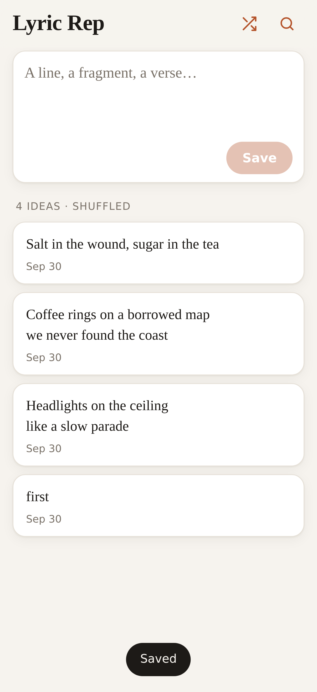
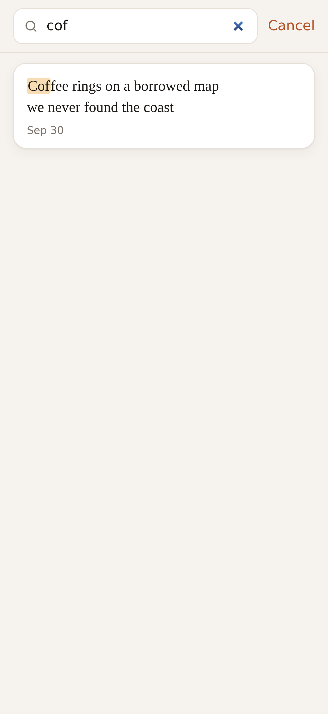

# Lyric Rep

**A home for stray song lines.** Stop losing lyric ideas across notes apps and random docs. Lyric Rep is a small app you add to your iPhone home screen. Type a line, a fragment or a whole verse, save it, and it goes into one private collection that you can shuffle and search.

It runs on your own Cloudflare account using [Workers](https://developers.cloudflare.com/workers/) and a [D1](https://developers.cloudflare.com/d1/) database. For personal use it fits easily within Cloudflare's free plan.

[](https://deploy.workers.cloudflare.com/?url=https://github.com/cobiadigital/lyric-rep)

<p>
  
  &nbsp;
  
</p>

## Features

- **Opens straight to a text box**, so you can get the line down before it's gone. Drafts survive closing the app.
- **Your past lines appear below in random order**, good for stumbling onto an old idea. Tap shuffle to reshuffle.
- **Live search.** Results update as you type, every word must match, and matches are highlighted.
- **Tap any entry** to copy, edit or delete it.
- **Works offline.** Lines saved with no signal stay on your phone and sync automatically when you're back online.
- **Built for iPhone home-screen mode:** full screen, respects the notch and home bar, follows light/dark mode.
- **Password protected**, so only you can read or add lines.
- No frameworks and no build step: plain HTML, CSS and JavaScript.

## Install on your own Cloudflare account

You'll need a free [Cloudflare account](https://dash.cloudflare.com/sign-up) and a [GitHub account](https://github.com/signup). You can do every step from a phone.

### Option A: One-click deploy (easiest)

1. Tap the **Deploy to Cloudflare** button above.
2. Sign in to Cloudflare and connect GitHub when asked. Cloudflare copies this project into a new repository on your GitHub account.
3. On the setup screen:
   - Keep or change the project name and the D1 database name. A new database is created for you.
   - Enter an **APP_PASSWORD**. This is the password you'll type once on each device to unlock the app.
   - Leave the deploy command as `npm run deploy`. It creates the database table and then deploys.
4. Tap **Create and deploy**. After a minute or two you'll get a URL like `https://lyric-rep.<your-subdomain>.workers.dev`.

From then on, every commit to your copy of the repo redeploys automatically.

### Option B: Fork and connect manually

1. **Fork** this repo on GitHub.
2. Create a D1 database: Cloudflare dashboard → **Storage & Databases** → **D1** → **Create**. Name it `lyric-rep` and copy its **Database ID**.
3. In your fork, edit `wrangler.jsonc` and replace `database_id` with your own ID. The one in this repo belongs to another account and won't work for you.
4. Dashboard → **Workers & Pages** → **Create** → **Import a repository** → pick your fork.
   - Build command: leave empty.
   - Deploy command: `npm run deploy`. This applies the database migration before each deploy.
5. After the first deploy, add your password: your Worker → **Settings** → **Variables and Secrets** → **Add** → type **Secret**, name `APP_PASSWORD`.

## Add it to your iPhone home screen

1. Open your Worker URL in **Safari**.
2. Tap **Share** → **Add to Home Screen**.
3. Open it from the home screen and enter your password once. It's remembered on that device.

## About the password

- If `APP_PASSWORD` is set, every API request needs it. If it isn't set, **anyone who finds your URL can read and add lines**, so set one.
- To change it, update the secret in the dashboard. Each device will ask for the new password on its next request.
- The password is stored in the browser's local storage on each device you unlock.

## How it works

```
public/                   The app (served as static assets)
  index.html, styles.css, app.js
  sw.js                   Service worker: offline app shell
  manifest.webmanifest    Home-screen app settings
  icons/
src/index.js              Worker API over D1
migrations/0001_init.sql  Database schema
wrangler.jsonc            Worker, assets and D1 config
```

API (all routes require `Authorization: Bearer <APP_PASSWORD>` when a password is set):

| Method | Path | Does |
| --- | --- | --- |
| `GET` | `/api/lyrics` | Up to 500 entries in random order |
| `GET` | `/api/lyrics?q=words` | Entries containing every word, newest first |
| `POST` | `/api/lyrics` | Add `{ "body": "...", "id"?: "...", "created_at"?: ms }` |
| `PUT` | `/api/lyrics/:id` | Update `{ "body": "..." }` |
| `DELETE` | `/api/lyrics/:id` | Delete |

New entries get an ID on the phone, so retrying an offline save never creates a duplicate.

## Customizing

- **Name and colors:** change the title in `public/index.html`, the name in `public/manifest.webmanifest`, and the color variables at the top of `public/styles.css`.
- **Icon:** replace the files in `public/icons/`. iOS uses the 180×180 `apple-touch-icon.png`.
- **After changing app files,** bump `CACHE` in `public/sw.js` (for example `lyric-rep-v2`) so installed copies pick up the change right away.

## Local development (optional)

Requires Node.js 18+.

```sh
npm install
cp .dev.vars.example .dev.vars   # set a local password
npm run migrate:local
npm run dev                      # http://localhost:8787
```

## License

[MIT](LICENSE). Use it, change it, and share it.
